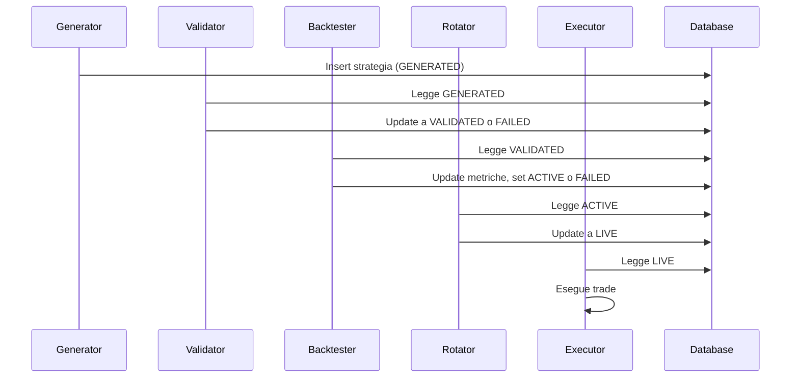
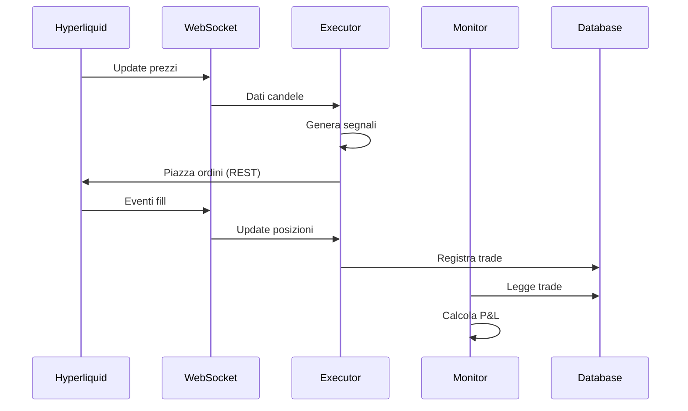
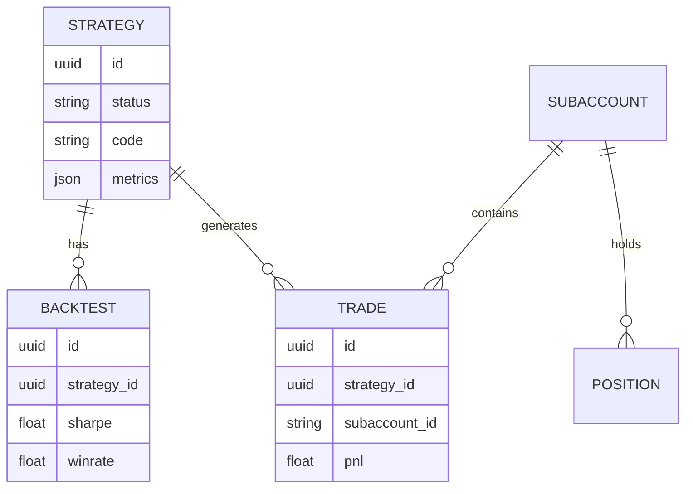

# Flusso Dati

Come i dati fluiscono nel sistema.

---

## Flusso Strategia

---

## Flusso Dati di Mercato

---

## Sorgenti Dati

### Dati Prezzo

| Sorgente | Uso |
|--------|-------|
| Hyperliquid WebSocket | Candele live, fill, posizioni |
| Binance CCXT | Dati storici per backtesting |

### Generazione Strategia

| Sorgente | Dati |
|--------|------|
| Pattern Discovery API | Pattern rilevati |
| Cataloghi Unger | Indicatori regime |
| AI (Claude/GPT) | Codice generato |

---

## Panoramica Schema Database

Vedi [Schema Database](../database/schema.md) per dettagli completi.

---

## Principi Chiave

### Hyperliquid e' Source of Truth

- Lo stato exchange e' canonico
- Il database e' solo audit trail
- In caso di conflitto, fidarsi dell'exchange

### WebSocket First

- Tutte le letture via WebSocket
- REST solo per azioni
- Rate limit: 1200 req/min (REST)

### No Lookahead

- I dati fluiscono solo avanti nel tempo
- Dati storici immutabili
- Segnali calcolati solo su dati passati
