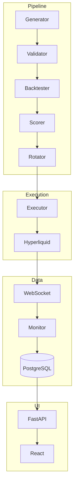

# Architettura

Design sistema e panoramica componenti.

---

## Panoramica

SixBTC e' un sistema di trading AI-powered con tre componenti principali:

1. **Pipeline** - Generazione, validazione e backtesting strategie
2. **Execution** - Trading live via Hyperliquid WebSocket
3. **Dashboard** - Frontend React per monitoring e controllo

---

## Architettura Alto Livello

---

## Documentazione

| Pagina | Contenuto |
|--------|---------|
| [System Overview](system-overview.md) | Descrizione dettagliata componenti |
| [Processi](processes.md) | 11 daemon services |
| [Flusso Dati](data-flow.md) | Come i dati fluiscono nel sistema |
