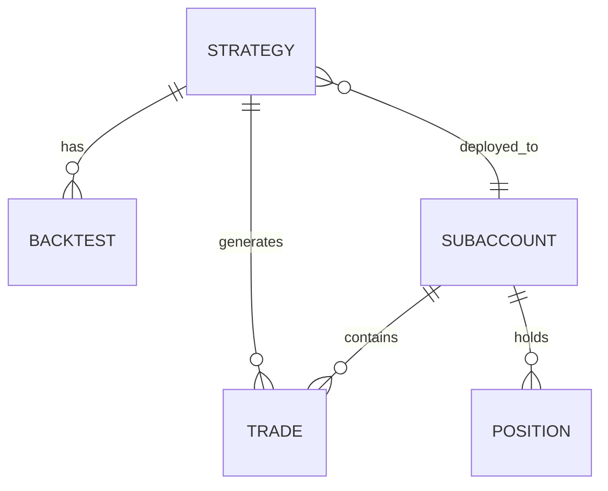

# Database

Schema PostgreSQL e modello dati.

---

## Panoramica

SixBTC usa PostgreSQL con 11 tabelle:

| Tabella | Scopo |
|-------|---------|
| `strategies` | Codice strategia e metadati |
| `backtests` | Risultati backtest |
| `trades` | Storico trade |
| `positions` | Posizioni correnti |
| `subaccounts` | Subaccount Hyperliquid |
| `candles` | Dati OHLCV |
| `patterns` | Pattern rilevati |
| `metrics` | Metriche sistema |
| `alerts` | Storico alert |
| `tasks` | Task schedulati |
| `emergency_stops` | Record emergency stop |

---

## Relazioni Chiave



---

## Documentazione

| Pagina | Contenuto |
|--------|---------|
| [Schema](schema.md) | Definizioni complete tabelle |

---

## Connessione

```yaml
database:
  url: "postgresql://bitwolf@localhost/sixbtc"
```

---

## Migrazioni

Usando Alembic:

```bash
# Crea migrazione
alembic revision --autogenerate -m "descrizione"

# Applica migrazioni
alembic upgrade head

# Rollback
alembic downgrade -1
```
