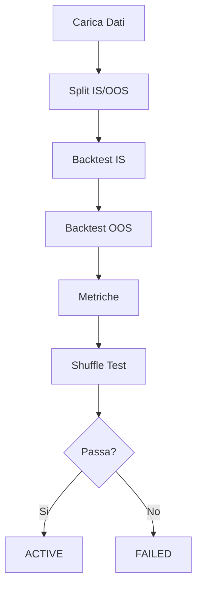

# Modulo Backtester

Backtesting ad alte prestazioni con Numba JIT.

---

## Panoramica

Il Backtester:

1. Carica strategie VALIDATED
2. Esegue test in-sample (IS)
3. Esegue test out-of-sample (OOS)
4. Calcola metriche
5. Esegue shuffle test per rilevamento lookahead

---

## Flusso Testing



---

## Numba JIT

Loop core compilati a codice nativo:

```python
@njit
def backtest_kernel(
    prices: np.ndarray,
    signals: np.ndarray,
    stop_losses: np.ndarray,
    take_profits: np.ndarray,
) -> Tuple[np.ndarray, np.ndarray]:
    """Loop backtest compilato JIT."""
    ...
```

Performance: 50x+ speedup rispetto a Python puro.

---

## Metriche Calcolate

| Metrica | Threshold |
|--------|-----------|
| Sharpe Ratio | >= 1.0 |
| Win Rate | >= 55% |
| Max Drawdown | <= 30% |
| Numero Trade | >= 100 |

---

## Configurazione

```yaml
backtester:
  is_ratio: 0.7
  min_trades: 100
  sharpe_threshold: 1.0
  winrate_threshold: 0.55
  max_dd_threshold: 0.30
```

---

## File Chiave

| File | Scopo |
|------|---------|
| `src/backtester/engine.py` | Engine backtest principale |
| `src/backtester/numba_kernels.py` | Funzioni compilate JIT |
| `src/backtester/metrics.py` | Calcolo metriche |
| `src/backtester/shuffle_test.py` | Rilevamento lookahead |

---

## Prevenzione Lookahead

!!! danger "No Lookahead Bias"
    - No `center=True` nelle operazioni rolling
    - No shift negativo (`shift(-1)`)
    - Validazione AST cattura pattern comuni
    - Shuffle test valida empiricamente
