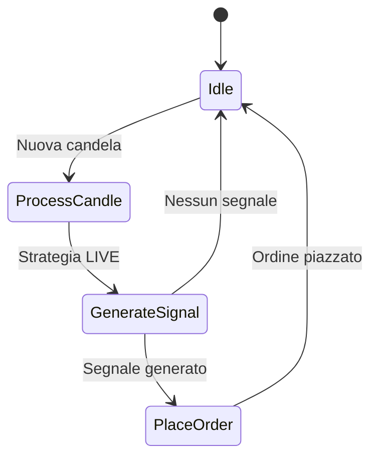
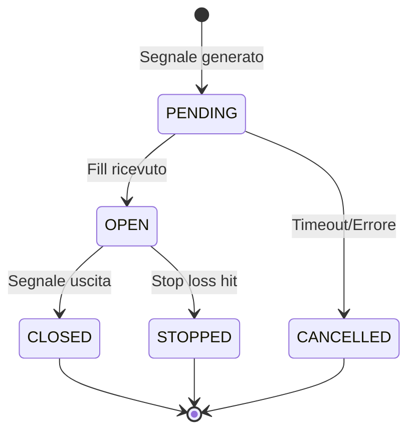

# Modulo Executor

Esecuzione trading live via Hyperliquid.

---

## Panoramica

L'Executor:

1. Monitora strategie LIVE
2. Riceve dati mercato via WebSocket
3. Genera segnali di trading
4. Piazza ordini via REST API
5. Traccia ciclo di vita posizioni

---

## Loop Esecuzione



---

## Ciclo di Vita Posizione



---

## Componenti Chiave

| Componente | Scopo |
|-----------|---------|
| `ExecutorMain` | Loop principale, orchestrazione |
| `PositionTracker` | Gestisce stato posizioni |
| `OrderManager` | Piazza/cancella ordini |
| `WebSocketClient` | Sottoscrizione dati mercato |

---

## Configurazione

```yaml
executor:
  poll_interval: 1.0
  order_timeout: 30
  max_slippage: 0.001
```

---

## Controlli Rischio

Salvaguardie integrate:

- Salta trade se margine insufficiente
- Salta trade se notional < 10 USDC
- Emergency stop su max drawdown
- Trigger review su loss consecutive

Vedi [Risk Management](../../reference/risk.md).

---

## File Chiave

| File | Scopo |
|------|---------|
| `src/executor/main_continuous.py` | Loop principale |
| `src/executor/position_tracker.py` | State machine posizioni |
| `src/executor/order_manager.py` | Piazzamento ordini |
| `src/executor/websocket_client.py` | Connessione WS |
