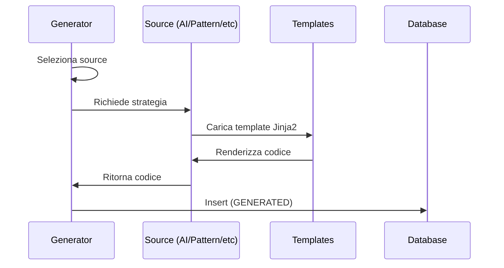

# Modulo Generator

Generazione codice strategia da multiple sorgenti.

---

## Panoramica

Il Generator crea codice strategia da 6 sorgenti diverse:

| Sorgente | Abbrev | Prefisso Classe | Descrizione |
|--------|--------|--------------|-------------|
| `pattern` | pat | `PatStrat_*` | Da pattern-discovery API |
| `pattern_gen` | pgn | `PGnStrat_*` | Composizione random intelligente |
| `unger` | ung | `UngStrat_*` | Coerente con regime (metodo Unger) |
| `pandas_ta` | pta | `PtaStrat_*` | Indicatori Pandas-TA |
| `ai_free` | aif | `AIFStrat_*` | AI sceglie indicatori |
| `ai_assigned` | aia | `AIAStrat_*` | AI con indicatori assegnati |

---

## Contratto Strategia

Tutte le strategie ereditano da `StrategyCore`:

```python
class StrategyCore:
    def generate_signal(self, df: pd.DataFrame) -> Signal | None:
        """
        Genera un segnale di trading.

        Args:
            df: DataFrame OHLCV con colonne [open, high, low, close, volume]

        Returns:
            Oggetto Signal o None se nessun segnale
        """
        raise NotImplementedError
```

---

## Flusso Generazione



---

## Configurazione

```yaml
generator:
  interval_seconds: 300
  batch_size: 10
  sources:
    - pattern
    - unger
    - ai_free
```

---

## File Chiave

| File | Scopo |
|------|---------|
| `src/generator/main.py` | Loop generator |
| `src/generator/templates/` | Template Jinja2 |
| `src/generator/unger/catalogs/` | Cataloghi indicatori Unger |
| `src/generator/pattern_discovery.py` | Client API pattern |

---

## Regole

!!! warning "No Hardcoding Prompt AI"
    Usare template Jinja2 in `src/generator/templates/`, non prompt inline.

!!! tip "Timeframe Agnostic"
    Usare `bars_in_period()` invece di valori hardcoded.
    Le strategie devono funzionare su 15m, 30m, 1h, 2h.
